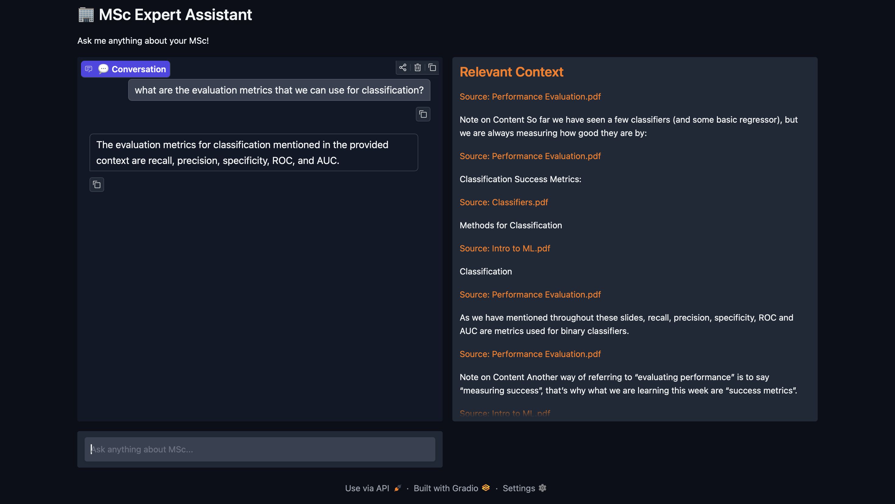

# MSc RAG

Retrieval-Augmented Generation pipeline for querying MSc course slides.

## What it does

Ask questions in natural language and get answers from your lecture slides.

## Features

- PDF text extraction using unstructured
- Vector embeddings with HuggingFace
- ChromaDB for semantic search
- Chat interface with history
- Gradio UI with context display

## Tech Stack

- Python
- LangChain
- ChromaDB
- HuggingFace Embeddings (sentence-transformers)
- Gradio
- Unstructured (PDF extraction)
- NLTK



## Setup

```bash
pip install -r requirements.txt
python ingest.py
python app.py